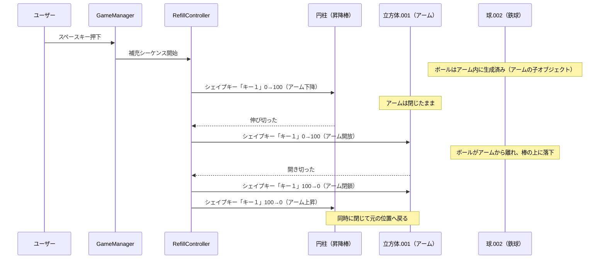

# 鉄球落とし（FallBall）新オブジェクト移行計画

## 背景
鉄球落とし用の本番オブジェクト（`fallball改.blend`）が完成したため、現在の仮置きオブジェクトから移行します。新しいBlenderファイルにはアニメーション（`Scene`クリップ）とシェイプキーが含まれており、ボール補充の一連の動作を実装します。

---

## 新オブジェクトの構成

| Blender上のオブジェクト名 | 役割 | スクリプトとの関連 |
|---|---|---|
| `handle1` | 左の棒 | `BarController.leftBar` |
| `handle2` | 右の棒 | `BarController.rightBar` |
| `球`, `球.001` | 棒の支柱（ピボット） | 棒の回転支点 |
| `円柱.005` | ゴール用カップ | `FallBallGoal` をアタッチ |
| `球.002` | 鉄球（初期位置：アーム内） | `FallBallGameManager.ballObject` |
| `立方体` | 棒の設置台 | 静的オブジェクト |
| `立方体.001` | 補充アーム | **シェイプキー「キー１」で開閉制御** |
| `円柱` | アーム昇降棒 | **シェイプキー「キー１」で伸縮制御** |
| `立方体.005` | 地面 | 静的オブジェクト |
| `glass` | ガラスカバー | 静的オブジェクト（透明マテリアル） |
| （ユーザーが手動で用意） | 操作用ハンドル | `BarController.operationHandle` |

---

## ボール補充アニメーションのシーケンス

シェイプキー（両方とも「キー１」）をスクリプトから制御して、以下の順序で補充動作を行います。
ボールは最初からアーム（`立方体.001`）の中に配置されており、アニメーションで2本の棒の間に降ろされます。



### ボール管理の方針
- 鉄球（`球.002`）を**テンプレート**として保持（非表示）
- 補充時にテンプレートを `Instantiate` し、アーム（`立方体.001`）の子オブジェクトとして配置
- アームが開いた瞬間にボールの親を解除（`SetParent(null)`）し、物理演算を有効化
- ボールがゴールまたは場外に到達したら `Destroy`

---

## 提案する変更内容

### ステップ 1: ブランチ作成
```bash
git checkout main && git pull origin main
git checkout -b feature/fallball_new_model
```

---

### ステップ 2: 新規スクリプトの作成

#### [NEW] FallBallRefillController.cs

ボール補充アニメーション（シェイプキー制御）を専門に管理するクラスを新規作成します。

```csharp
// 概要イメージ
public class FallBallRefillController : MonoBehaviour
{
    [Header("シェイプキー対象")]
    [SerializeField] private SkinnedMeshRenderer rodRenderer;   // 円柱（昇降棒）
    [SerializeField] private SkinnedMeshRenderer armRenderer;   // 立方体.001（アーム）
    
    [Header("ボール設定")]
    [SerializeField] private GameObject ballTemplate;           // 鉄球テンプレート（球.002）
    [SerializeField] private Transform ballSpawnParent;         // アーム（立方体.001）のTransform

    [Header("タイミング設定")]
    [SerializeField] private float extendDuration = 1.0f;       // 昇降棒が伸びる時間
    [SerializeField] private float openDuration = 0.5f;         // アームが開く時間
    [SerializeField] private float retractDuration = 1.0f;      // 戻る時間（閉鎖＋上昇を同時）
    
    // シェイプキー名: 両方とも「キー１」
    // BlendShapeIndex は Start() で自動取得
    
    public bool IsRefilling { get; private set; }
    
    public IEnumerator PlayRefillSequence()
    {
        IsRefilling = true;
        
        // 1. ボールをアーム内にスポーン（アームの子として）
        // 2. 昇降棒を伸ばす（シェイプキー 0→100）
        // 3. アームを開く（シェイプキー 0→100）
        // 4. ボールの親を解除、Rigidbody有効化（自由落下開始）
        // 5. アームを閉じつつ昇降棒を縮める（同時に 100→0）
        
        IsRefilling = false;
    }
}
```

**主な機能**:
- `SkinnedMeshRenderer.SetBlendShapeWeight()` でシェイプキー「キー１」を制御
- コルーチンで補充シーケンスを順次実行
- `IsRefilling` フラグで連打防止
- 各フェーズの所要時間は Inspector から調整可能

---

### ステップ 3: 既存スクリプトの修正

#### [MODIFY] [FallBallGameManager.cs](file:///Users/apple/Documents/Unity/FEVER-CAPITAL/Assets/App/MiniGames/Scripts/FallBall/FallBallGameManager.cs)
- `FallBallRefillController` への参照を追加
- `SpawnNewBall()` を修正: `RefillController.PlayRefillSequence()` を呼び出す方式に変更
- 補充アニメーション中（`IsRefilling == true`）はスペースキーを無視

#### [MODIFY] [BarController.cs](file:///Users/apple/Documents/Unity/FEVER-CAPITAL/Assets/App/MiniGames/Scripts/FallBall/BarController.cs)
- コード変更なし。Inspector で以下を付け替えるのみ:
  - `leftBar` → `handle1`
  - `rightBar` → `handle2`
  - `operationHandle` → ユーザーが手動で用意するハンドル

---

### ステップ 4: Unityエディタでの設定（ユーザー作業）

スクリプト作成後にユーザーにお願いする手動設定：

1. **FALLBALLシーンに新モデルを配置**:
   - `fallball改.blend` を Hierarchy にドラッグ
   - 旧オブジェクトを削除（または非表示）

2. **コライダーの設定**:
   - `handle1`, `handle2`: 棒に合わせた Box Collider（鉄球が転がるため）
   - `円柱.005`（ゴール）: Trigger 付き Collider
   - `球.002`（鉄球）: Sphere Collider + Rigidbody
   - `立方体.005`（地面）: Box Collider
   - `glass`: Mesh Collider（透明壁として）

3. **タグの設定**:
   - `球.002`（鉄球）に `Player` タグを設定

4. **操作用ハンドルの準備（ユーザー）**:
   - Cube や Plane を半透明にして棒の手前に配置
   - `BarController.operationHandle` にセット

5. **スクリプトのアタッチと Inspector 設定**:
   - `FallBallRefillController` を適切な親オブジェクトにアタッチ
     - `rodRenderer` → `円柱` の `SkinnedMeshRenderer`
     - `armRenderer` → `立方体.001` の `SkinnedMeshRenderer`
     - `ballTemplate` → `球.002`
     - `ballSpawnParent` → `立方体.001` の Transform
   - `FallBallGameManager` の Inspector 更新
     - `ballObject` → `球.002`
     - `refillController` → 上記の `FallBallRefillController`
   - `FallBallGoal` を `円柱.005` にアタッチ
   - `FallBallOutZone` を地面の下に Trigger で配置

---

### ステップ 5: 動作テスト

- [ ] スペースキーでボール補充アニメーションが再生される
- [ ] 昇降棒（`円柱`）のシェイプキー「キー１」が正しく伸縮する
- [ ] アーム（`立方体.001`）のシェイプキー「キー１」が正しく開閉する
- [ ] ボールがアーム内から棒の上に正確に配置される
- [ ] ボールの物理演算（自由落下）が正常に開始される
- [ ] 棒の操作（マウスドラッグ）が正常に動作する
- [ ] ゴール判定（`円柱.005`）が正常に動作する
- [ ] 場外判定が正常に動作する
- [ ] 補充アニメーション中にスペースキー連打しても二重スポーンしない

---

## 検証計画
- FALLBALLシーンでプレイモードにして手動テスト
- コンソールログで状態遷移・アニメーション再生を確認
